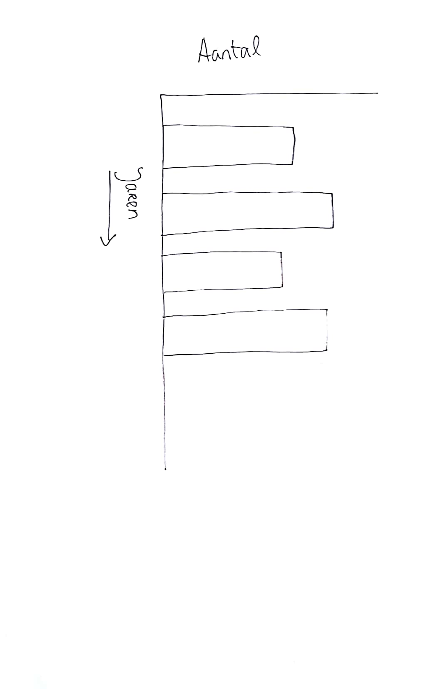
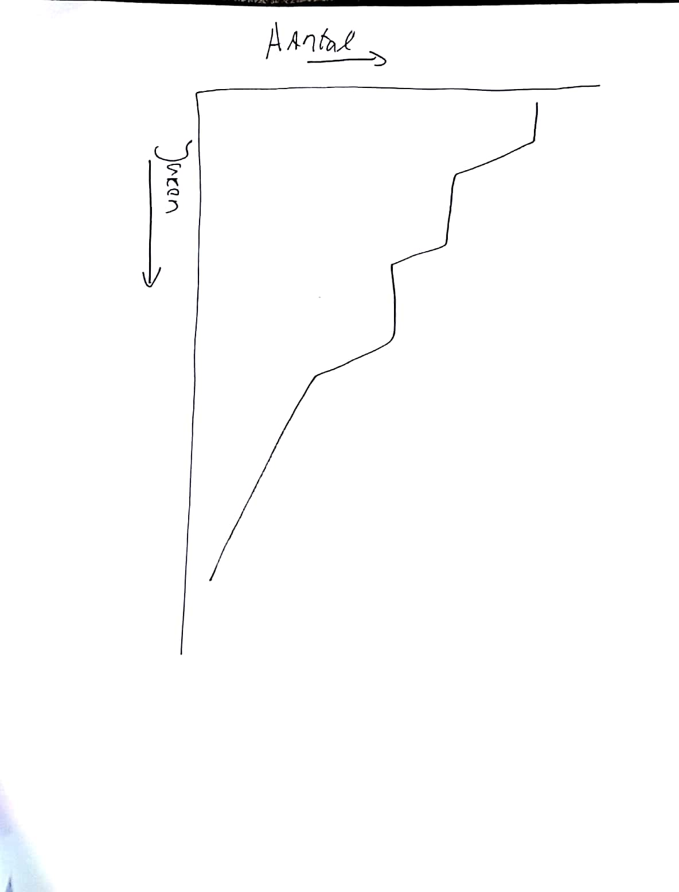

# Functional Programming
Tijdens dit vak gaan we een datavisualisatie maken van de data van de oba api.


## Inhoudsopgave
1. [Onderzoeksvragen](#onderzoeksvragen)
2. [Huidige Onderzoeksvraag](#huidig)
3. [Data van Oba](#dataOba)
4. [Proces](#proces)


<a name="onderzoeksvragen"></a>
## Onderzoeksvragen

* Na de opkomst van de Smartphones zijn er meer E-boeken bijgekomen dan fysieke boeken
  * In welke jaar was de opkomst van Smarthphones
  * Hoeveel boeken zijn er elke jaar bijgekomen
  * Hoeveel EBoeken zijn er elke jaar bijgekomen
  * Wat is het verschil tussen de bijkomen boeken vs de EBoeken

* Eboeken zijn de afgelopen jaren vaker geleent tov fysieke boeken
  * Aantal uitgeleende boeken in de afgelopen jaren
  * Aantal geleende eboeken in de afgelopen jaren

* Nieuwe schrijvers na 2010 hebben vaker letter a in hun naam
  * Hoeveel schrijvers zijn er na 2010 bijgekomen
  * Hoeveel schrijers hebben de letter a in hun naam

* Fysieke afmetingen van de kaft van boeken zijn steeds kleiner vanaf 2010
  * Fysieke afmetingen van kaft in 2010
  * Fysieke afmetingen van kaft in 2011 t/m 2018

* CD varianten van boeken zijn sinds 2013 tot heden geleidelijk afgenomen
  * CD varianten in 2013 t/m 2018
  * Afgenomen varianten per jaar vanaf 2013


<a name="huidig"></a>
## Uiteindelijke Onderzoeksvraag:

De variatie in formaten(niet de afmetingen, maar fysieke formaat zoals cd, dvd etc) zijn de afgelopen jaren geleidelijk afgenonomen.

**Deelvragen**
* Hoeveel type formaten zijn er?
* Hoeveel formaten zijn er uitgekomen per jaar?

**Onderzoeks properties**
* Jaartal(publication)
* Verschillende types(cd, boek, etc)
* De types in de onderverdeeld in de verschillende jaren

**Nodige methods(welke functions moet ik schrijven?)**
* Optellen van fysieke boeken van elke jaar na opkomst van Smartphones
* Optellen van de verschillende formaten die de afgelopen 10 jaar zijn uitgekomen
* De formaten optellen per jaar.
* Jaren sorteren
* De jaren clusteren (ervoor zorgen dat de jaren uniniek worden)


<a name="dataOba"></a>
## Data van de oba
Hieronder zie je de oba api structuur van title en author van een boek. Maar het structuur is min of meer overal hetzelfde.
```
{ titles:
     { title:
        { translation: 'Titel',
          'search-method': 'title',
          'search-term':
           "'Het geweten der natie' : de voormalige illegaliteit in het bevrijde Zuiden, september 1944-mei 1945 / door Henk Termeer",
          'search-type': 'fuzzy',
          '$t':
           "Het geweten der natie : de voormalige illegaliteit in het bevrijde Zuiden, september 1944-mei 1945 / door Henk Termeer" },
       'short-title':
        { translation: 'Korte titel',
          '$t':
           "'Het geweten der natie' : de voormalige illegaliteit in het bevrijde Zuiden, september 1944-mei 1945" } },
    authors:
     { 'main-author':
        { 'search-method': 'author',
          'search-term': 'H.J.C. Termeer',
          'search-type': 'searcher',
          translation: 'Auteur (hoofd)',
          firstname: 'H.J.C.',
          lastname: 'Termeer',
          creatortype: 'person',
          main: 'true',
          '$t': 'Termeer, H.J.C.' } }
```

**Structuur:** Hierboven is een kleine stukje van de oba api beschreven. De code hierboven bestaat alleen maar uit de autor en de titel van een bepaalde boek, maar laat wel het algemene strucuur zien van de api. Elk categorie van een boek heeft meerdere lagen. Om bijvoorbeeld bij de titel te komen van een boek, moet je eerst naar titles > title > $t. Dus het de title van een boek kan je pas vinden in de $t property van het object.

<a name="proces"></a>

## Schetsen
Omdat mijn onderzoeksvraag vooral bestaat twee factoren namelijk  jaren en variatie in een bepaalde jaar. Daarom heb ik schetsen gemaakt van een simpele bar chart en lijn diagram. Dit zijn simpele diagrammen om mee te beginnen in D3. Ik begin liever zo simpel mogelijk om de basis te begrijpen en als ik dat begrijp ga ik wat moeilijker diagrammen proberen te maken.




## Het Proces
In dit hoofdstuk kan je het proces zien van het project. In "Mijn proces verhaal" kan je de grote lijnen vinden van het proces in één groot verhaal. In "Dagelijkse proces" kan je het proces vinden per dag beschreven en in meer detail en meer technische details.

### Mijn proces verhaal
Net zoals alle andere technische vakken dat ik op de opleiding CMD heb gehad was dat er in het begin heel veel frustratie was. Ik begreep praktische niks, maar door middel van veel vragen aan medestudenten werd ik steeds wijzer tot het punt dat ik andere mensen kon helpen. Persoonlijk vind ik het jammer dat ik in het begin vaak naar mensen moet afstappen om voor hulp te vragen. Daarom vraag ik actief naar mensen of ze mij hulp nodig hebben, omdat ik weet hoe naar het kan zijn om niet verder te gaan vanwege gebrek aan kennis. Na het opdoen van veel kennis had ik meer vertrouwen om het zelf te doen en begon ik zelf functie's te schrijven en zelf ook errors op te lossen. Mijn waardevolste ontdekking is dat ik zoveel moet console.loggen om erachter te komen waar mijn code foutgaat. Uiteindelijk is het mijn na veel errors en syntaxen uitproberen is het mij gelukt om schone data te krijgen met een object met daarin de property's jaartal en variatie(de variatie in presentatie van content zoals boek, cd etc)

**Waar had ik het meest moeite mee**<br>
Het lastigste vond ik wel dat de database van de oba uit verschillende lagen bestaat. Het was heel lastig voor mij om te ontdekken hoe ik door de verschillende lagen kan gaan om de echte uiteindelijke data te krijgen. Sommige data hadden zelfs nog een array in verwerkt.

**Wat vond ik het leukste om te doen**<br>
De eerste 3 a 4 dagen vond ik niks leuk. Dit kwam omdat ik er qua kennis nog te weinig wist om echt te gaan beginnen. Na wat moed op te sparen en aan mensen vragen hoe sommige dingen werken begreep ik er meer van en begon ik langzamerhand coderen leuker te vinden. Wat specifieker vond ik het toepassen van de verschillende array methods interessant. Het was voor mij een kunst om te weten welke array method ik moet gebruiken voor een bepaalde probleem. Door meer te lezen op MDN en het meteen toepassen van de array methods begreep ik steeds meer van!. Het is echt fijn om nieuwe syntaxen te leren en vervolgens meteen toepassen en zien dat het daadwerkelijk werkt. Natuurlijk werkt niet altijd, maar dan is het oplossen ook weer leuk omdat je daardoor ook weer leert waarom het niet werkt.

**Maar het leukste:** Maar wat ik het allerleukst vind om te doen is om andere mensen te helpen. Ik weet namelijk hoe frustrerend kan zijn om iets niet te begrijpen en dat je niet verder komt puur omdat je iets niet begrijp. Vooral op het gebied van technische vakken is het niet begrijpen een motivatie killer. Wanneer ik mensen ga helpen begrijpen ze het meer en krijgen ze ook meer hoop en dat vind ik wel fijn. Nogmaals ik ben ook iemand die dit zovaak had en heb meegemaakt. Naast dat durven mensen ook niet vaak te vragen aan andere mensen en het is gewoon jammer dat ze daardoor niet verder kunnen komen.


### Dagelijkse proces
Hieronder kan je het dagelijkse proces vinden. Per dag beschrijf ik wat ik geleerd heb en waar ik tegen aanliep er word ook een opsomming gemaakt van de dingen dat ik(vaak samen met ander studenten) heb ondekt

#### Day 1: Dinsdag 29 oktober 2018
In dag 1 heb ik de documentatie van de aquabrowser gelezen. Naast dat heb ik niet veel kunnen bereiken behalve de api draained kunnen krijgen op mijn terminial.

**Ontdekkingen**
* node index.js om de script te runnen via node

#### Day 2: Dinsdag 30 oktober 2018
**Ontdekkingen**
* De database werkt in lagen in lagen dus als je bij een titel wilt komen moet je naar titles > title gaan en vervolgens
nog $t om de daadwerkelijke titel te vinden.
* Door middel van facet etc. kan ik voordat er uberhaupt gezocht word al gaan filteren door de database.


#### Day 3: Woensdag 31 oktober 2018
Dankzij Joost kon ik de undefined error catchen door middel van if statement. Want bij een undefined categorie kregen we steeds
een error waardoor het helemaal niet meer werkte. Het probleem was dat sommige resultaten bepaalde categoriën niet hadden waardoor het
een error gaf en daardoor werkte alles niet meer.

```js
  title: book.titles.title.$t,
  taal: (typeof book.languages === "undefined" || typeof book.languages.language === "undefined") ? 'Taal onbekend' : book.languages.language.$t,
  jaartal: (typeof book.publication === "undefined" || typeof book.publication.year === "undefined") ? 'Jaar onbekend' : book.publication.year.$t,
  author: (typeof book.authors === "undefined" || typeof book.authors['main-author'] === "undefined") ? "Auteur onbekend" : book.authors['main-author'].$t,
  format: (typeof book.formats === "undefined" || typeof book.formats.format === "undefined") ? "Formaat onbekend" : book.formats.format.$t
```

**Ontdekkingen**
* Undefined error catchen
* Sommige resultaten hebben bepaalde categoriën niet
* In de property van een object kan je een if statement declareren door de nieuwe ternary declaratie
* Typeof is een methods om de type van een variabele te bekijken


#### Day 4: Donderdag 1 november 2018
Vandaag heb ik de functions aangemaakt om bepaalde resultaten te krijgen op basis van bepaalde conditie's.
```js
let fromYear = filterByYear(array);

function filterByYear(booklist) {
  const result = booklist.filter(function(book) {
    if (book.jaartal > 2008) {
      return book
    }
  })
  return result;
}
```
**Ontdekkingen**
* Een variabele kan een function bevatten
* Als er een function in de variable zit is hetgeen wat de function returned wat in de variable zich bevind. Als de function een array terugstuurd zit er in de variabele een array

#### Day 5: Vrijdag 2 november 2018
Tijdens het testen naar een andere zoekterm liet mijn terminal alweer een undefined errror zien. Na lang zoeken waar het probleem lag kwam ik erachter dat sommige formats van boeken meerder formats beschikken die in een array zitten. Maar tegen de tijd dat ik dit gevonden had was het al tijd om naar huis te gaan

**Ontdekkingen**
* Sommige categoriën hebbenn meerdere waardes die weer in een array zitten

#### Day 6: Maandag 5 november 2018
Na de ontdekking van afgelopen vrijdag probeerde ik op maandag 5 november dit probleem op te lossen. Dit heb ik gedaan door aan de object property format een function aan te koppelen die meerdere if statements heeft om de array te laten zien.
```js
function makeBookObject(book) {
  bookObject = {
    // Credits aan Joost
    title: (typeof book.titles === "undefined" || typeof book.titles.title === "undefined") ? 'Titel is onbekend' : book.titles.title.$t,
    taal: (typeof book.languages === "undefined" || typeof book.languages.language === "undefined") ? 'Taal onbekend' : book.languages.language.$t,
    jaartal: (typeof book.publication === "undefined" || typeof book.publication.year === "undefined") ? 'Jaar onbekend' : book.publication.year.$t,
    author: (typeof book.authors === "undefined" || typeof book.authors['main-author'] === "undefined") ? "Auteur onbekend" : book.authors['main-author'].$t,
    format: checkFormat(book)
  }
  array.push(bookObject)
}

function checkFormat(book) {
  if (book.formats) {
    if (book.formats.format.$t) {
      return book.formats.format.$t
    } else {
      let formats = [];
      book.formats.format.forEach(format => {
        formats.push(format.$t);
      });
      return formats;
    }
  } else {
    return "Formaat is onbekend"
  }
}
```
**Ontdekkingen**
* Het is mogelijk om een function aan een object property te hangen.
* In een if-stament kan je nog een if-statment zetten om te kijken naar de verschillende lagen.

# Honerable Mentions
**Wouter:**
Wouter heeft mij geholpen met vele functie's schrijven. Zonder hem zou ik nog dagenlang vastzitten met hetzelfde probleem. Hij heeft de function jaartalFormatObject geschreven voor mij en de module geschreven waardoor ik meerdere items kon laten zien dan 20 in de terminal. Naast dat heeft hij ook sommige array methods in detail uitgelegt hoe ze werken. Wat een ware held.

**Joost:** Danzkij Joost kon ik de undefined errors catchen met een functie die hij heeft geschreven. Naast dat heeft hij mij ook haarfijn uitgelegt hoe de database werkte en dat er meerdere lagen waren. Hierdoor gaf hij mij meer hoop om door te gaan met coderen.
